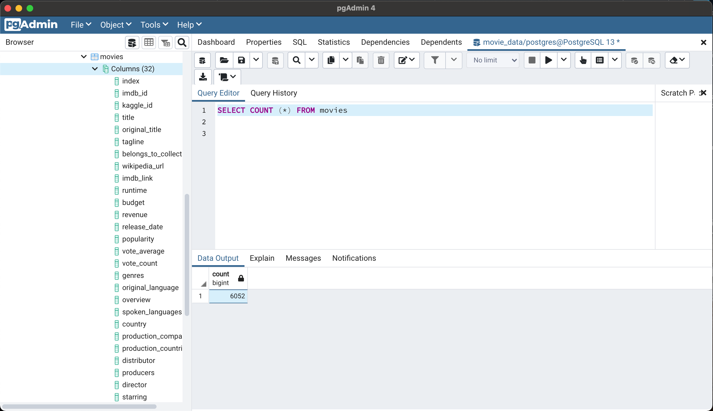
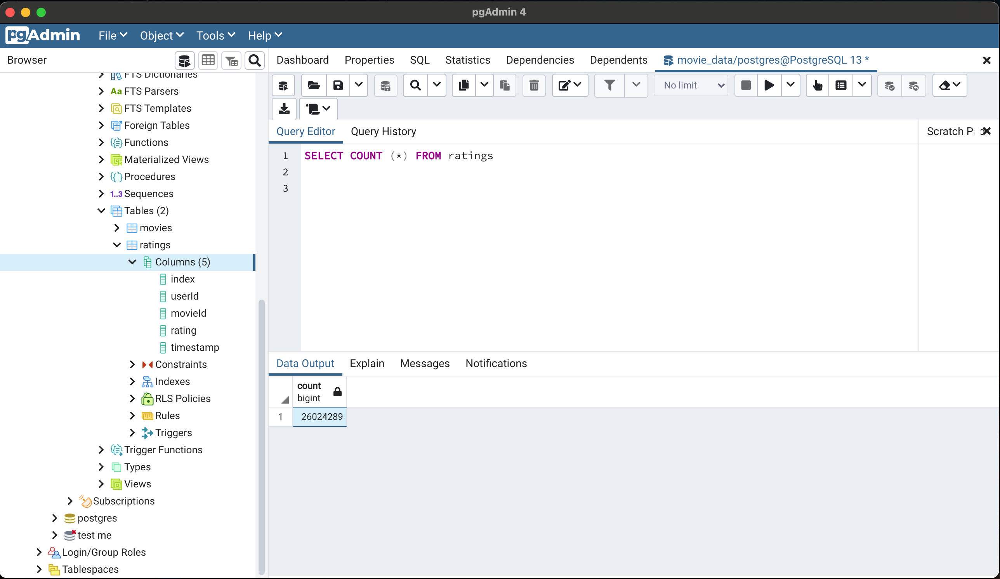

# Movies-ETL
Create an automated pipeline for Amazing Prime, a platform for streaming movies and TV shows, to update data on a daily basis for their analysis.  
There are two data sources:
- Scrape of Wikipedia for all movies released since 1990 
- Rating data from the Movie Land's webiste  
The project needs to extract the data from the two sources, transform it into one clean data set, and finally load that data set into a SQL table. 

## Process
- Deliverable 1: Write an ETL Function to Read Three Data Files 
  <a href = "https://github.com/angelnga/Movies-ETL/blob/main/ETL_function_test.ipynb"> ETL_function_test.ipynb </a> 
  - wikipedia-movies.json
  - movies_metadata.csv
  - ratings.csv 
   
- Deliverable 2: Extract and Transform the Wikipedia Data 
  <a href = "https://github.com/angelnga/Movies-ETL/blob/main/ETL_clean_wiki_movies.ipynb"> ETL_clean_wiki_movies.ipynb </a>
   
- Deliverable 3: Extract and Transform the Kaggle data 
  <a href = "https://github.com/angelnga/Movies-ETL/blob/main/ETL_clean_kaggle_data.ipynb"> ETL_clean_kaggle_data.ipynb </a>
   
- Deliverable 4: Create the Movie Database 
  <a href = "https://github.com/angelnga/Movies-ETL/blob/main/ETL_create_database.ipynb"> ETL_create_database.ipynb </a>

  
  
  

